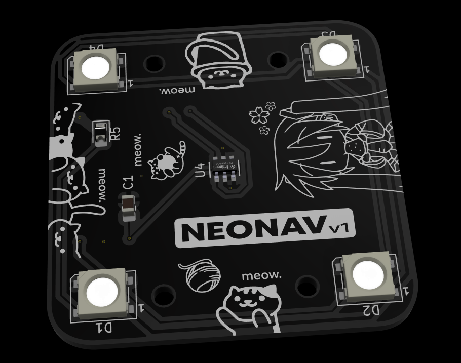
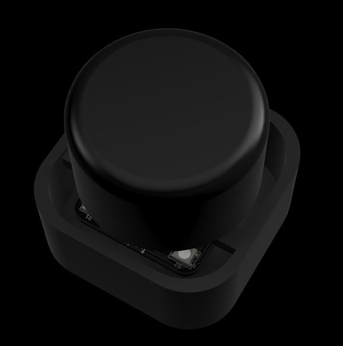

# neonav
neonav is a three degrees of freedom mouse designed for intuitive navigation in 3D virtual environments. Traditional 2D mice fall short when you need to move fluidly through three-dimensional spaces - especially when you're modeling in CAD software. This input device captures motion across three axes (X, Y, and Z), allowing you to push, pull, tilt, and rotate your way through 3D environments with natural hand movements.

## PCB

## Case

## PCB Schematic

## Bill of Materials
| Value            | Quantity | LCSC Link                                                                                                                                                   |
|------------------|----------|-------------------------------------------------------------------------------------------------------------------------------------------------------------|
| 0805X5R106K500NT | 1        | https://lcsc.com/product-detail/Multilayer-Ceramic-Capacitors-MLCC-SMD-SMT_AIDE-CAPACITOR-0805X5R106K500NT_C48579582.html?s_z=n_10uF%25200805%2520capacitor |
| WS2812B          | 4        | https://lcsc.com/product-detail/RGB-LEDs-Built-in-IC_Worldsemi-WS2812B-V5-W_C2874885.html?s_z=n_WS2812B                                                     |
| ARG05FTC5000     | 1        | https://lcsc.com/product-detail/Chip-Resistor-Surface-Mount_Viking-ARG05FTC5000_C2828857.html?s_z=n_500%2520ohm%25200805%2520resisto                        |
| XIAO-RP2040-SMD  | 1        | https://www.aliexpress.com/item/1005003682505451.html                                                                                                       |
| TLV493DA1B6HTSA2 | 1        | https://lcsc.com/product-detail/3D-Magnetic-Sensors_Infineon-TLV493DA1B6HTSA2_C126688.html?s_z=n_TLV493DA1B6HTSA2                                           |
